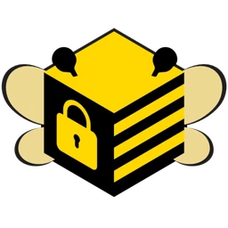
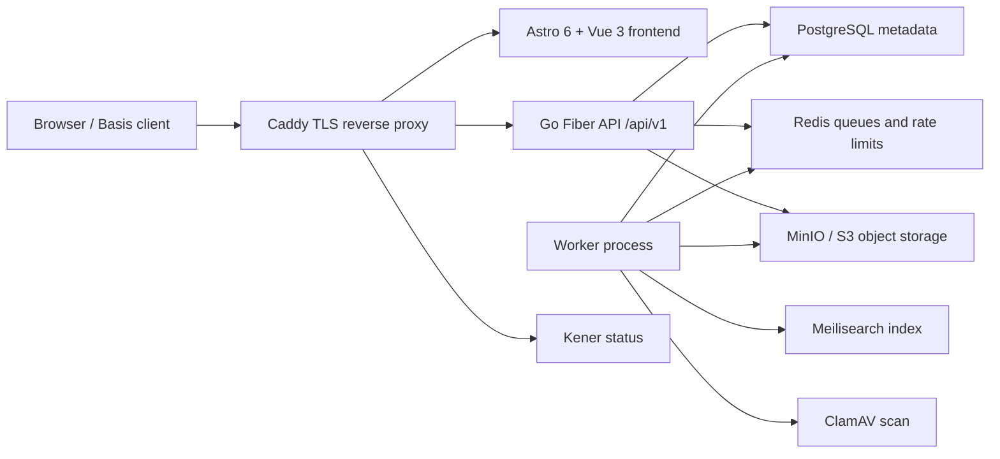

<div align="center">
  
  <h1>.BEEBA</h1>
  <p><strong>Production-ready Basis / VR content catalog for worlds, avatars, props, and prefabs.</strong></p>

  <p>
    
    
    
    
  </p>
</div>

## Overview

.BEEBA is an API-first content platform for user-uploaded Basis `.bee` packages.
It is built around safe uploads, moderation, searchable public catalog pages,
creator profiles, social signals, admin tooling, and a versioned API for future
Basis client integration.

The repository is structured for production deployment with Docker
Compose, Caddy, PostgreSQL, Redis, Meilisearch, MinIO-compatible object storage,
worker queues, ClamAV, and Kener status monitoring.

## Product Scope

| Area | What is included |
| --- | --- |
| Catalog | Worlds, Avatars, Props, Prefabs, category pages, public profiles, SEO routes, sitemap, Open Graph image |
| Uploads | `.bee` package upload, preview/gallery images, avatar uploads, owner workspace, storage quota |
| Safety | Quarantine storage, SHA-256 hashing, Basis package validation, ClamAV scan, moderation states |
| Social | Likes, comments, reports, NSFW filtering, public counters |
| Account | Registration, login, email verification, password change by email, email change by email, Turnstile support |
| Admin | Moderation, users, files, jobs, taxonomy, audit log, operational status |
| API | Public versioned API under `/api/v1`, OpenAPI document, Scalar API reference |

## Architecture



### Upload Pipeline

```text
metadata validation
  -> stream .bee to quarantine object storage
  -> calculate SHA-256
  -> persist metadata in PostgreSQL
  -> enqueue worker job
  -> ClamAV scan and Basis package validation
  -> moderation / publication policy
  -> controlled backend download endpoint
```

Quarantine objects are never public. Approved downloads are served through the
backend so access control, counters, rate limits, and HTTP range requests stay
under application control.

## Stack

| Layer | Technology |
| --- | --- |
| Frontend | Astro 6, Vue 3, TypeScript, Pinia, GSAP, Lenis, Toastify, Lucide |
| Backend | Go 1.26.3, GoFiber v3, pgx, Redis client, MinIO client |
| Data | PostgreSQL 18, Redis 8, Meilisearch 1.28 |
| Storage | MinIO / S3-compatible buckets for `.bee` packages and images |
| Workers | File scanning, Basis validation, image processing, email jobs, search indexing |
| Security | Argon2id, signed/controlled downloads, CSRF headers, rate limits, Caddy security headers |
| Infra | Docker Compose, Caddy 2.10, ClamAV, Kener status page |
| API docs | `Backend/openapi/openapi.yaml`, served as `/openapi.yaml` and `/api-reference` |

## Repository Map

| Path | Purpose |
| --- | --- |
| `Backend/cmd/api` | API process entrypoint |
| `Backend/cmd/worker` | Background worker process |
| `Backend/cmd/migrate` | Database migration runner |
| `Backend/internal/http` | Router, middleware, HTTP handlers |
| `Backend/internal/repository/postgres` | PostgreSQL persistence |
| `Backend/internal/security` | Auth, crypto, upload validation, image processing, scans |
| `Backend/migrations` | Forward and rollback database migrations |
| `Backend/openapi/openapi.yaml` | Public API contract |
| `Frontend/src/pages` | Astro routes, public pages, protected page shells |
| `Frontend/src/components` | Vue islands and Astro components |
| `Frontend/src/lib/api` | Typed frontend API clients |
| `Frontend/src/styles` | Split CSS by base, layout, components, pages, responsive |
| `infra/caddy` | Development, production, and storage Caddyfiles |
| `infra/kener` | Status page seed data and branding |
| `infra/prod` | Production environment templates |

## Local Development

### Requirements

| Tool | Notes |
| --- | --- |
| Docker Desktop or Docker Engine | Required for the full local stack |
| Git | Required for cloning and branch work |
| Node.js 22.12+ | Optional outside Docker, required for direct frontend commands |
| Go 1.26.3 | Optional outside Docker, required for direct backend tests |

### Start the Full Local Stack

```powershell
git clone https://github.com/saint4626/BeeBa.git
cd BeeBa
docker compose -f docker-compose.dev.yaml up --build
```

### Local URLs

| Service | URL |
| --- | --- |
| Site through Caddy | `http://127.0.0.1:8088` |
| Status page through Caddy | `http://127.0.0.1:8089` |
| Astro dev server | `http://127.0.0.1:4321` |
| Backend API | `http://127.0.0.1:8080/api/v1` |
| OpenAPI document | `http://127.0.0.1:8088/openapi.yaml` |
| MinIO console | `http://127.0.0.1:9001` |
| Meilisearch | `http://127.0.0.1:7700` |

### Useful Local Checks

```powershell
cd Backend
go test ./...
```

```powershell
cd Frontend
npm ci
npm run build
Get-ChildItem tests -Filter *.test.ts | ForEach-Object { node $_.FullName }
```

```powershell
docker compose -f docker-compose.dev.yaml config --quiet
docker compose -f docker-compose.api.yaml config --quiet
docker compose -f docker-compose.storage.yaml config --quiet
```

## Production Deployment

The production setup supports two layouts:

| Layout | Compose file | Use when |
| --- | --- | --- |
| Split API/front and storage | `docker-compose.api.yaml` + `docker-compose.storage.yaml` | Preferred production layout |
| Single VPS | `docker-compose.prod.yaml` | Smaller deployments or staging |

### Preferred Split Layout

| Server | Public domains | Compose file | Main services |
| --- | --- | --- | --- |
| API/front server | `example.org`, `www.example.org`, `api.example.org`, `status.example.org` | `docker-compose.api.yaml` | Caddy, Astro frontend, Go API, worker, migrations, PostgreSQL, Redis, Meilisearch, ClamAV, Kener, backups |
| Storage server | `s3.example.org`, `storage.example.org` | `docker-compose.storage.yaml` | Caddy, MinIO |

DNS should point the API/front domains to the API server and the storage domains
to the storage server. Caddy obtains and renews TLS certificates automatically.

### Storage Server

Create a storage env file from the template and set strong credentials. These
credentials must match the API server's MinIO variables.

```powershell
Copy-Item infra/prod/storage.env.example infra/prod/storage.env
notepad infra/prod/storage.env
```

Required values:

| Variable | Purpose |
| --- | --- |
| `MINIO_ROOT_USER` | S3 access key used by the API server |
| `MINIO_ROOT_PASSWORD` | S3 secret key used by the API server |
| `MINIO_SERVER_URL` | Public S3 endpoint, normally `https://s3.example.org` |
| `MINIO_BROWSER_REDIRECT_URL` | MinIO console URL, normally `https://storage.example.org` |

Start storage:

```powershell
docker compose --env-file infra/prod/storage.env -f docker-compose.storage.yaml pull
docker compose --env-file infra/prod/storage.env -f docker-compose.storage.yaml up -d
docker compose --env-file infra/prod/storage.env -f docker-compose.storage.yaml logs -f caddy minio
```

Health check:

```powershell
curl https://s3.example.org/minio/health/ready
```

### API / Frontend Server

Create the API env file:

```powershell
Copy-Item infra/prod/api.env.example infra/prod/api.env
notepad infra/prod/api.env
```

Minimum production variables:

| Variable | Purpose |
| --- | --- |
| `POSTGRES_PASSWORD` | PostgreSQL password |
| `MEILI_MASTER_KEY` | Meilisearch master key |
| `MINIO_ROOT_USER` | Must match the storage server access key |
| `MINIO_ROOT_PASSWORD` | Must match the storage server secret key |
| `BEEBA_MINIO_ENDPOINT` | Storage endpoint, normally `s3.example.org` |
| `BEEBA_MINIO_USE_SSL` | `true` for the split storage server |
| `BEEBA_SECRET_BOX_KEY` | Base64 32-byte encryption key for sensitive stored values |
| `BEEBA_RESEND_API_KEY` | Transactional email provider key |
| `BEEBA_TURNSTILE_SECRET_KEY` | Cloudflare Turnstile backend secret |
| `PUBLIC_TURNSTILE_SITE_KEY` | Cloudflare Turnstile frontend site key |
| `KENER_SECRET_KEY` | Status page secret |

Generate a new secret-box key:

```powershell
openssl rand -base64 32
```

Start API/front:

```powershell
docker compose --env-file infra/prod/api.env -f docker-compose.api.yaml build
docker compose --env-file infra/prod/api.env -f docker-compose.api.yaml up -d
docker compose --env-file infra/prod/api.env -f docker-compose.api.yaml logs -f caddy backend worker frontend
```

Health checks:

```powershell
curl https://example.org/readyz
curl https://example.org/openapi.yaml
curl https://status.example.org
```

### Single-Server Production Fallback

For a one-server deployment, use `docker-compose.prod.yaml`. In that layout MinIO
runs inside the same compose project, so use a dedicated env file and set:

```text
BEEBA_MINIO_ENDPOINT=minio:9000
BEEBA_MINIO_USE_SSL=false
```

Then start:

```powershell
docker compose --env-file infra/prod/api.env -f docker-compose.prod.yaml up -d --build
```

## Runtime Limits

| Limit | Default |
| --- | --- |
| `.bee` package upload | `2147483648` bytes, 2 GB |
| Image upload | `8388608` bytes, 8 MB |
| User storage quota | `10737418240` bytes, 10 GB |
| Public download rate limit | 60 per hour |
| Owner download rate limit | 120 per hour |
| Registration rate limit | 10 per hour |
| Login rate limit | 20 per 15 minutes |

## Security Notes

| Control | Implementation |
| --- | --- |
| Password hashing | Argon2id |
| Auth sessions | Server-issued sessions with refresh handling |
| CSRF | Mutating browser requests send `X-CSRF-Token` |
| Rate limits | Redis-backed rules for auth, uploads, downloads, social actions, admin actions |
| File safety | Extension checks, content decoding, SHA-256, quarantine, scan jobs |
| Object storage | Generated object keys, no raw filenames as storage keys |
| Images | Accepted PNG/JPEG are converted to WebP by worker processing |
| Secrets | Use env files on servers. Do not commit `.env` or `infra/prod/*.env` |
| Headers | Caddy sets HSTS, content-type protection, frame protection, referrer policy, permissions policy |

## Operational Notes

| Topic | Notes |
| --- | --- |
| Migrations | `migrate` service runs before API and worker startup |
| Backups | API/front production compose keeps daily PostgreSQL dumps for 14 days |
| Search | Meilisearch is derived state; PostgreSQL remains the source of truth |
| Queues | Worker jobs are persisted in PostgreSQL and coordinated through worker loops |
| Status | Kener runs on `status.example.org` and can monitor API plus storage readiness |
| Branches | `production` should mirror the deployable `developer` state before release |

## API Surface

| Route | Description |
| --- | --- |
| `/api/v1` | Versioned API root |
| `/openapi.yaml` | OpenAPI document served by the backend |
| `/api-reference` | Scalar API reference page |
| `/healthz` | Liveness endpoint |
| `/readyz` | Readiness endpoint |
| `/content-sitemap.xml` | Public content sitemap |
| `/robots.txt` | Search crawler policy |
